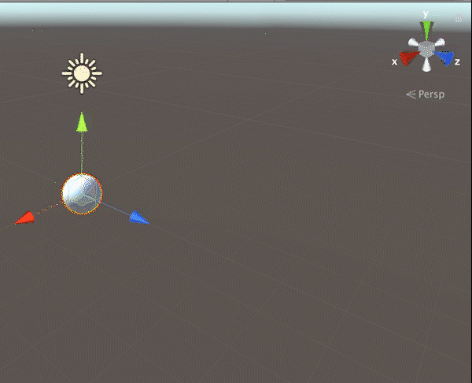
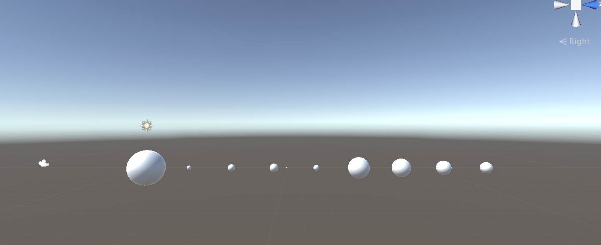
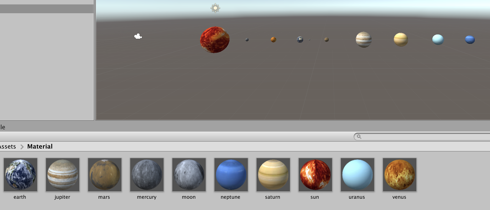
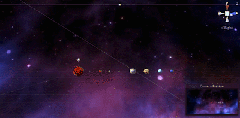
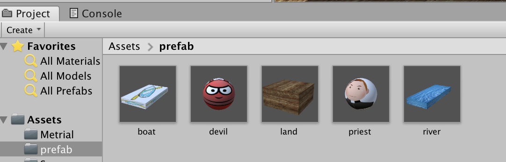

1. 简答并用程序验证

   - 游戏对象运动的本质是什么？

     游戏对象运动本质就是使用矩阵变换（平移、旋转、缩放）改变游戏对象的空间属性。

   - 请用三种方法以上方法，实现物体的抛物线运动。（如，修改Transform属性，使用向量Vector3的方法…）

     - 用vector3改变tramsfrom，直接让位置按斜抛运动规律变化即可。

       ```c#
       public class parabola1 : MonoBehaviour
       {
           private float v0;
           private float angle;
           private float vx;
           private float vy;
           // Start is called before the first frame update
           void Start()
           {
               angle = Mathf.PI/3;
               v0 = 10;
               vx = v0 * Mathf.Cos(angle);
               vy = v0 * Mathf.Sin(angle);
           }
           // Update is called once per frame
           void Update()
           {
               vy -= 9.8f * Time.deltaTime;
               Vector3 aaa = new Vector3(vx, vy, 0) * Time.deltaTime;
               this.transform.position += aaa;
           }
       }
       ```

     - 使用`transform.Translate`方法，意思是每帧往抛物线切线方向移动一个单位长度。

       ```c#
       void Update()
       {
           vy -= 9.8f * Time.deltaTime;
           Vector3 bbb = new Vector3(vx, vy, 0) * Time.deltaTime;
           this.transform.Translate(bbb);
       }
       ```

     - 用`Vector.Lerp`，意思是从`transform.position`到`transform.position + ccc`的方向，每秒移动一个单位长度。

       ```c#
       void Update()
       {
           vy -= 9.8f * Time.deltaTime;
           Vector3 ccc = new Vector3(vx, vy, 0) * Time.deltaTime;
           this.transform.position = Vector3.Lerp(transform.position, transform.position + ccc, 1);
           }
       ```

     代码运行结果如图所示。

     

   - 写一个程序，实现一个完整的太阳系， 其他星球围绕太阳的转速必须不一样，且不在一个法平面上。

     首先创建十个球体，分别命名为太阳系各大行星的名字，依照现实改变星球大小。

     

     接下来创建material来美化星球。[怎么样做一个材质球？](https://blog.csdn.net/Jaihk662/article/details/86746756)  [找不到贴图？](https://tieba.baidu.com/p/4876471245?red_tag=2938874589)

     

     接下来实现旋转的部分，RotateSround为公转，三个参数分别为中心点、旋转轴（即实现不同法平面）和转速。Rotate为自转，参数为自转速度，依照现实来改变旋转速度。其中月球的公转中心应该是地球而不是太阳。

     ```c#
     using System.Collections;
     using System.Collections.Generic;
     using UnityEngine;
     
     public class move : MonoBehaviour {
     
       public Transform Sun;
       public Transform Moon;
       public Transform Mercury;//水星
       public Transform Venus;//金星
       public Transform Earth;//地球
       public Transform Mars;//火星
       public Transform Jupiter;//木星
       public Transform Saturn;//土星
       public Transform Uranus;//天王星
       public Transform Neptune;//海王星
     
       // Use this for initialization
       void Start () {
           Sun.position = Vector3.zero;
       }
     
       // Update is called once per frame
       void Update () {
           Mercury.RotateAround (Sun.position, new Vector3(0, 5, 1), 60 * Time.deltaTime);
           Mercury.Rotate ( new Vector3(0, 5, 1) * 10000 / 58 * Time.deltaTime);
     
           Venus.RotateAround (Sun.position, new Vector3(0, 2, 1), 55 * Time.deltaTime);
           Venus.Rotate (new Vector3(0, 2, 1) * 10000/ 243 *Time.deltaTime);
     
           Earth.RotateAround (Sun.position, Vector3.up, 50 * Time.deltaTime);
           Earth.Rotate (Vector3.up * 30 * Time.deltaTime);
           Moon.transform.RotateAround (Earth.position, Vector3.up, 5 * Time.deltaTime);
     
           Mars.RotateAround (Sun.position, new Vector3(0, 12, 5), 45 * Time.deltaTime);
           Mars.Rotate (new Vector3(0, 12, 5) * 10000 * Time.deltaTime);
     
           Jupiter.RotateAround (Sun.position, new Vector3(0, 10, 3), 35 * Time.deltaTime);
           Jupiter.Rotate (new Vector3(0, 10, 3) * 10000/0.3f * Time.deltaTime);
     
           Saturn.RotateAround (Sun.position, new Vector3(0, 3, 1), 20 * Time.deltaTime);
           Saturn.Rotate (new Vector3(0, 3, 1) * 10000/0.4f * Time.deltaTime);
     
           Uranus.RotateAround (Sun.position, new Vector3(0, 10, 1), 15 * Time.deltaTime);
           Uranus.Rotate (new Vector3(0, 10, 1) * 10000/0.6f * Time.deltaTime);
     
           Neptune.RotateAround (Sun.position, new Vector3(0, 8, 1), 10 * Time.deltaTime);
           Neptune.Rotate (new Vector3(0, 8, 1) * 10000/0.7f * Time.deltaTime);
       }
     }
     ```

     最后添加轨迹和背景，调节camera拍摄视角。整个太阳系模拟就做好了。[不知道怎么添加？](https://blog.csdn.net/zzj051319/article/details/62042221)

     运行效果如图，整体效果还是比较梦幻的。

     

2. 编程实践

   阅读以下游戏脚本

   >Priests and Devils
   >
   >Priests and Devils is a puzzle game in which you will help the Priests and Devils to cross the river within the time limit. There are 3 priests and 3 devils at one side of the river. They all want to get to the other side of this river, but there is only one boat and this boat can only carry two persons each time. And there must be one person steering the boat from one side to the other side. In the flash game, you can click on them to move them and click the go button to move the boat to the other direction. If the priests are out numbered by the devils on either side of the river, they get killed and the game is over. You can try it in many > ways. Keep all priests alive! Good luck!

   程序需要满足的要求：

   - 游戏规则 [play the game]( http://www.flash-game.net/game/2535/priests-and-devils.html )

     - 你要运用智慧帮助3个牧师（方块）和3个魔鬼（圆球）渡河。
     - 船最多可以载2名游戏角色。
     - 船上有游戏角色时，你才可以点击这个船，让船移动到对岸。
     - 当有一侧岸的魔鬼数多余牧师数时（包括船上的魔鬼和牧师），魔鬼就会失去控制，吃掉牧师（如果这一侧没有牧师则不会失败），游戏失败。
     - 当所有游戏角色都上到对岸时，游戏胜利。

   - 列出游戏中提及的事物（Objects）

     3个魔鬼，3个牧师，船，河流，两边的陆地

   - 用表格列出玩家动作表（规则表），注意，动作越少越好

     |   玩家动作    |                执行条件                |     执行结果      |
     | :-----------: | :------------------------------------: | :---------------: |
     | 点击牧师/魔鬼 | 游戏没有结束；船靠岸且和船在相同的岸上 | 牧师/魔鬼移到船上 |
     |    点击船     |       游戏未结束；船上至少有一人       |  船移动到另一岸   |

   - 请将游戏中对象做成预制

     

   - 在 GenGameObjects 中创建 长方形、正方形、球 及其色彩代表游戏中的对象。

   - 使用 C# 集合类型 有效组织对象

   - 整个游戏仅 主摄像机 和 一个 Empty 对象， **其他对象必须代码动态生成！！！** 。 整个游戏不许出现 Find 游戏对象， SendMessage 这类突破程序结构的 通讯耦合 语句。 **违背本条准则，不给分**

   - 请使用课件架构图编程，**不接受非 MVC 结构程序**

     - Model：游戏中的对象，它们受到Controller的控制来决定它们的行为。
     - View：展示游戏结果，支持用户的交互操作。
     - Controller：控制游戏对象的运动；FirstController控制着这个场景中的所有对象，包括其加载、通信、用户输入。Director类控制着场景的创建、切换、销毁、游戏暂停、游戏退出等等最高层次的功能。
   
   - 注意细节，例如：船未靠岸，牧师与魔鬼上下船运动中，均不能接受用户事件！
   
   
   
   
   
   博客地址 [点击这里](https://blog.csdn.net/Metamorphosis_Anja/article/details/101124339)
   
   